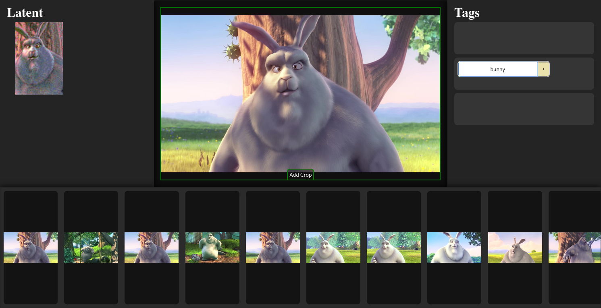
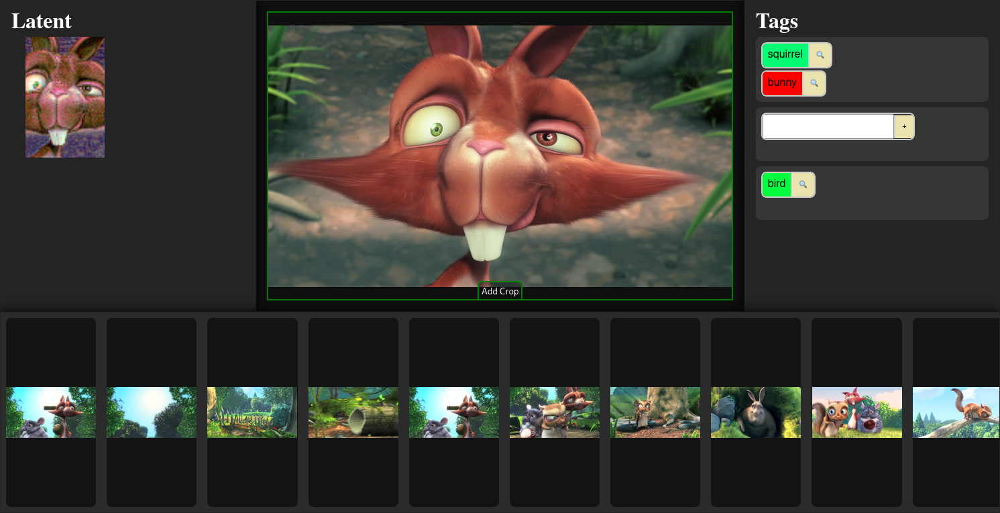

Taggart - The Vision Model Aided Image Tagger
=============================================

Instead of a proper README let's have a little walkthrough instead:

Download the movie Big Buck Bunny and split it into 4s screenshots:

```bash
$ git clone https://github.com/hnez/taggart
$ mkdir images
$ cd images
$ wget "https://download.blender.org/peach/bigbuckbunny_movies/big_buck_bunny_1080p_h264.mov"
$ ffmpeg -i big_buck_bunny_1080p_h264.mov -r 0.25 output_%04d.jpg
$ cd ..
```

---

Install dependencies:

```bash
$ python3 -m venv venv
$ source ./venv/bin/activate
$ python3 -m pip install diffusers sentencepiece transformers
```

---

Add images to the (new) database:

```bash
$ python3 main.py add ../images
```

---

Generate siglip image embeddings for the newly added images:

```bash
$ python3 main.py embeddings
```

---

Run the taggart server:

```bash
$ python3 main.py serve
Bottle v0.13.2 server starting up (using WSGIRefServer())...
Listening on http://127.0.0.1:8080/
Hit Ctrl-C to quit.
```

---

View images in the web interface until you find one that you want to add a tag to:



---

Once you have tagged a few images you can start browsing by tag:


---

If you discover images that do not match the tag, select it and tag them
negatively (using shift + click).



After a bit of back and forth the tag view should become relatively clean.
